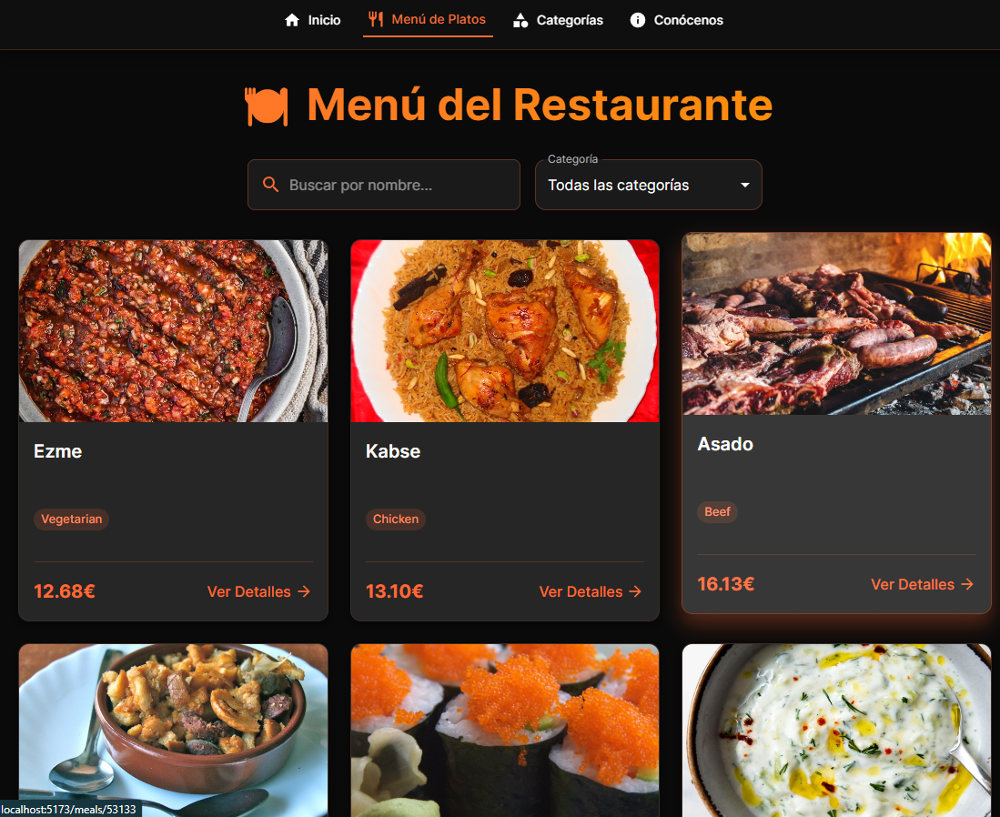

# Menú de Restaurante

¡Hola! Este es mi proyecto de menú de restaurante. Es una aplicación web de una sola página (SPA) que muestra una lista de platos deliciosos, organizados por categorías, con un diseño moderno y oscuro.



## ¿Qué hace este proyecto?

Esta aplicación te permite:
- **Ver un menú completo**: Muestra fotos y nombres de platos traídos desde una API externa.
- **Buscar platos**: Puedes escribir el nombre de una comida en el buscador para encontrarla rápidamente.
- **Filtrar por categoría**: Puedes seleccionar categorías específicas (como "Seafood", "Dessert", etc.) para ver solo esos platos.
- **Ver detalles**: Si haces clic en "Ver Receta" en un plato, verás sus instrucciones de preparación, categoría y área de origen.
- **Explorar Categorías**: Una página dedicada para ver todas las categorías de comida disponibles.
- **Conocernos**: Una página "Sobre Nosotros" que cuenta nuestra historia y misión.

## Tecnologías que usé

Para crear este proyecto, utilicé varias herramientas y bibliotecas modernas de desarrollo web:

*   **React**: La biblioteca principal de JavaScript para construir la interfaz de usuario.
*   **Vite**: Una herramienta de construcción rápida para proyectos web modernos.
*   **Material UI (MUI)**: Una biblioteca de componentes de diseño que utilicé para los botones, tarjetas, inputs y la estructura general, dándole un aspecto profesional.
*   **React Router**: Para manejar la navegación entre las diferentes páginas (Inicio, Menú, Categorías, Detalles) sin recargar el navegador.
*   **TheMealDB API**: Una API pública gratuita de donde obtengo toda la información e imágenes de las comidas.

## Características Especiales

*   **Tema Oscuro**: He configurado un tema visual oscuro con acentos en color naranja (`#ff6b35`) para darle un toque elegante y moderno.
*   **Diseño Responsivo**: La aplicación se adapta a diferentes tamaños de pantalla gracias a los componentes de Material UI.

## Estructura del Proyecto

El código está organizado de la siguiente manera en la carpeta `src`:

*   `components/`: Contiene todas las páginas y piezas de la interfaz.
    *   `Layout.jsx`: La estructura principal que incluye la barra de navegación superior.
    *   `MealsPage.jsx`: La página principal donde se busca y filtra el menú.
    *   `MealDetailsPage.jsx`: Muestra la información detallada de un plato específico.
    *   `CategoriesPage.jsx` y `CategoryPage.jsx`: Para navegar por tipos de comida.
    *   `AboutPage.jsx`: Información sobre el restaurante.
*   `main.jsx`: El punto de entrada de la aplicación donde configuro el enrutador y el tema.
*   `theme.js`: Archivo de configuración donde definí la paleta de colores personalizada.

## Cómo instalar y ejecutar

Si quieres probar este proyecto en tu computadora, sigue estos pasos:

1.  **Instalar las dependencias**:
    Abre la terminal en la carpeta del proyecto y ejecuta:
    ```bash
    npm install
    ```

2.  **Iniciar el servidor de desarrollo**:
    Una vez instaladas las dependencias, ejecuta:
    ```bash
    npm run dev
    ```
    Esto iniciará el servidor y te mostrará una dirección (normalmente `http://localhost:5173`) para abrir en tu navegador.

¡Espero que disfrutes explorando el menú!
